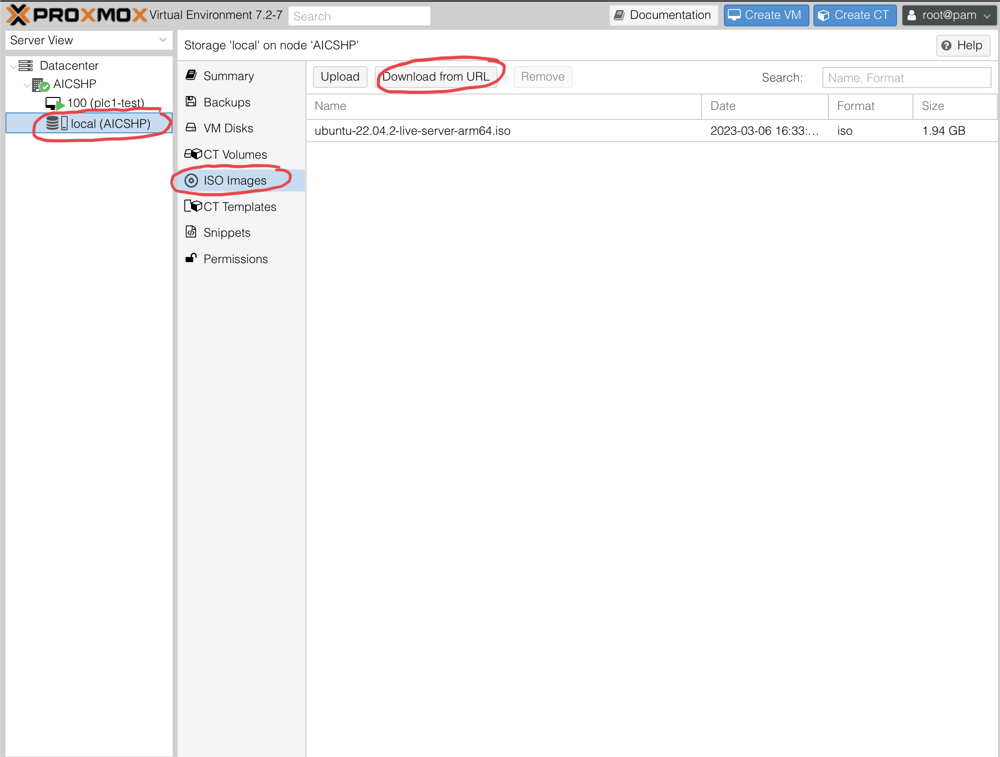
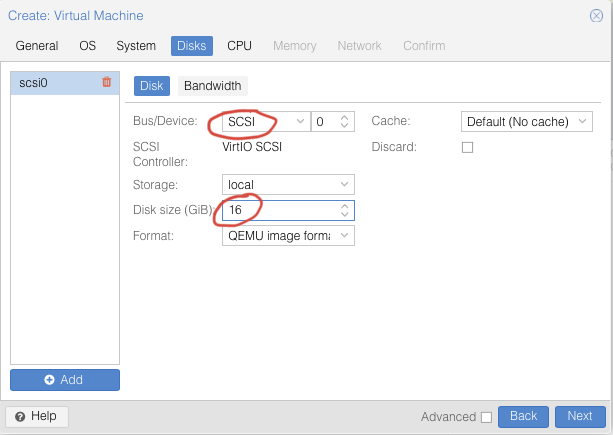
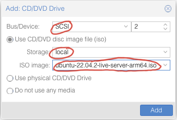

# Install

### Install Proxmox:

For x86-64, install the ISO on the baremetal machine.

[Proxmox Downloads](https://www.proxmox.com/en/downloads)

Then you should be able to access Proxmox at `https://the.ip.you.assigned:8006`

1. The default login is:

   - username: *root*
   - password: *you set this during installation*
2. In the Proxmox web server:

   - 
3. Download the Ubuntu 22.04.2 server for AMD64 iso in Proxmox:

   - 
   - [Ubuntu Server for AMD64](https://ubuntu.com/download/server)
4. Create the VM:

   - 
   - Name the VM
   - 
   - 
   - 
   - Allow at least 16Gb
   - 
   - Add as many cores and CPUs as needed
   - Give the VM 4 Gb of RAM
   - Leave the network settings exactly how they are by default
   - Confirm your choices
   - 
   - 
   - 
   - Select the ISO for booting
   - 
   - 
   - 
5. Ubuntu Server Installation Options:

    - 
    - Language
    - Keyboard Layout
    - *Ubuntu Server*
    - Auto Configured Network Connection
    - No Proxy
    - Default Storage Configuration Options
    - Name
    - Server Name
    - Username & Password <-- *make sure the username is ***aicshp*** or things will break later*
    - Skip pro
    - *Install openssh server*
    - Choose the Docker snap
6. After installing and reaching the "remove installation medium" message, change the boot order or remove the CD drive.

### Install Dependencies:

`git clone https://github.com/VigilantBag/AICSHP && cd AICSHP`

`chmod +x *.sh`

`./installdeps.sh`

Reboot the system

After restart, install Zeek:

`./installzeek.sh`

If you want to run Zeek/Tshark and Kibana on one machine, install the promiscuous mode option on the host machine:

`./installzeek-promisc.sh`

### OpenPLC Usage

Web GUI available at [127.0.0.1:8080](127.0.0.1:8080)

Default login: openplc:openplc

Restart system or VMs to restart PLC

### Scaling

Refer to the [Proxmox guide](https://pve.proxmox.com/wiki/Cluster_Manager)
