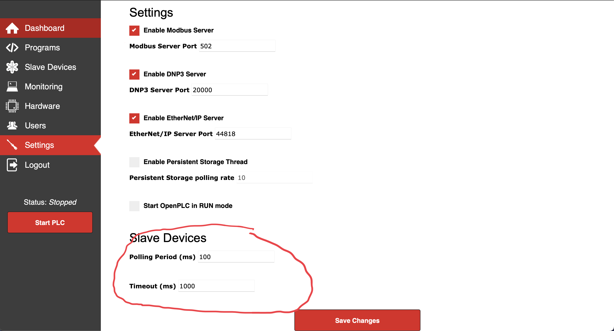
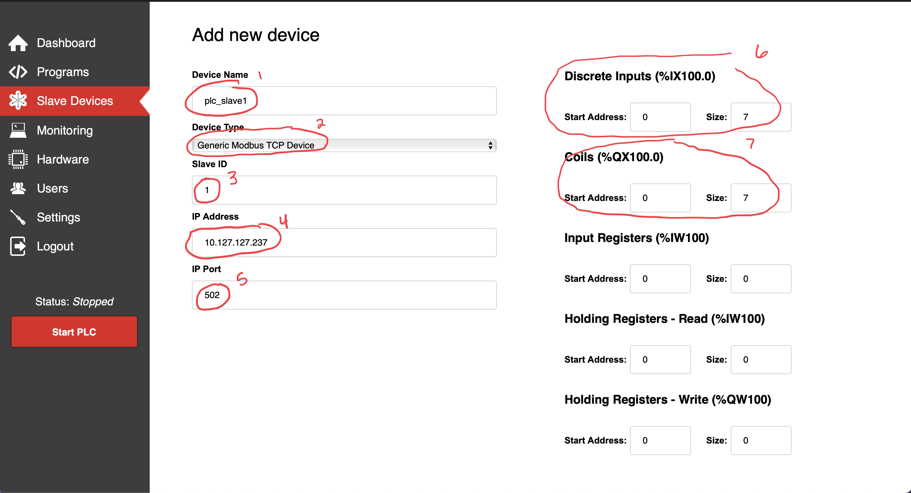
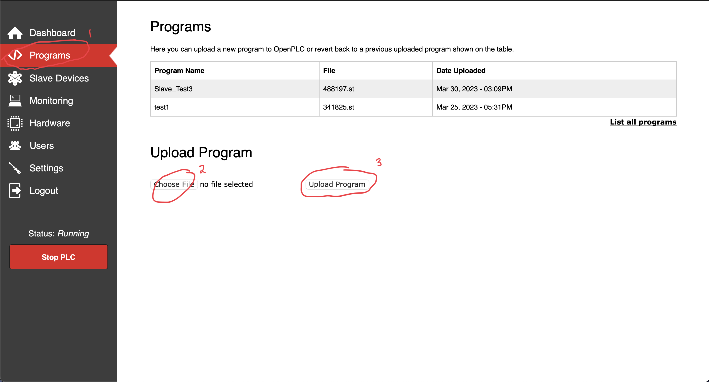

# Adding PLC Slave Devices

**After creating the proxmox server and running the installation script, plc slave devices can be created using two or more of these pimox/proxmox virtual machines.**

## Resources
- [OpenPLC's Video Tutorial](https://www.youtube.com/watch?v=dQ8GcfpGDuA)
- [OpenPLC Physical Addressing Documentation](https://openplcproject.com/docs/2-4-physical-addressing/)
- [OpenPLC Modbus Addressing](https://openplcproject.com/docs/2-5-modbus-addressing/)
- [OpenPLC Slave Devices](https://openplcproject.com/docs/2-6-slave-devices/)

## Open Both Webserver Applications in a web-browser

- 
    - This *Settings* page shows the slave settings for the modbus slaves, as well as all of the ports which modbus slaves rely on.
    - The *Polling Period* is frequency that reads are read, leave this at the default 100ms.

- On the first PLC webserver (http://*the_ip_address_of_the_vm*:8080):
    - 
        1. Set the *Name* for the slave device. 
        2. Set the *Device Type* to Generic Modbus TCP Device.
        3. Set the *Slave ID* to 1.
        4. Set the *IP Address* to the address of the second plc which you wish to make a slave.
        5. Set the *Port* to 502, the default port for modbus connections.
        6. Set the *Discrete Inputs* to 0 and 7 representing the 0 to 7 inputs accepted by a Raspberry PI.
        7. Set the *Coils* to 0 and 7 representing the 0 to 7 coils the which can be addressed on the RaspberryPI.
        8. Set the remaining values to 0 as they will not be used.

## Uploading the ST Files

**After configuring the two plcs, they must be configured with the corressponding st files.**

 

1. On the **master plc** click *Programs* then choose the [plc master file](../../examples/plc_master.st) and upload the program

2. On the **slave plc** follow the same process this time uploading the [plc slave file](../../examples/plc_slave.st)

3. Start the **master plc** then the **slave plc**

## Performing a Sanity Check to Ensure PLC communication

- Configure line 4 in the [read plc](../sanity_check/read_plc1.py) and  files to reflect the IP addresses of both VMs. 
- On the physical Raspberry Pi install python3-pip and install pymodbus
    - `sudo apt install python3-pip`
    - `pip3 install pymodbus`
- Copy the *read plc* files to the Pi
- Run the two plc files simultaneously to ensure a connection
    - `python3 read_plc1.py`
    - `python3 read_plc2.py`