# Arm64 (rpi) Pimox and OpenPlc Installation instructions

**Important Notes**

- [Pimox Github](https://github.com/pimox/pimox7)
- This works as of March 7, 2023.
- You must use a pi with 4GB or more of RAM, 8 GB is reccomended. 

---

## Setting Up the Physical Pi and Installing Pimox

---

1. Install [Raspberry Pi OS Lite (64-bit)](https://downloads.raspberrypi.org/raspios_oldstable_lite_armhf/images/raspios_oldstable_lite_armhf-2023-02-22/2023-02-21-raspios-buster-armhf-lite.img.xz). **This will _ONLY_ work with the 64-bit lite version** 

2. Using the raspberry pi imager software: 
    - enable ssh
    - set the username and password
    - configure LAN (if you're using wifi)
    - set the timezone/keyboard

3. In the raspberry pi lite installation you just created, run:
    - `# sudo su` <-- logins in as root
    - `# apt-get update && apt-get upgrade -y` <-- update the system
    - `# curl https://raw.githubusercontent.com/pimox/pimox7/master/RPiOS64-IA-Install.sh > RPi_Install.sh` <-- downloads the pimox installation script
    - `# chmod +x RPi_Install.sh` <-- make the installation script executable
    - `# ./RPi_Install.sh` <-- run the installation script
    - at this point simply follow the prompts in the script

4. Once the system has been restarted run
    - `# sudo apt upgrade -y` <--upgrades the system one final time finishing the installation

5. Then you should be able to access Pimox at `http://the-ip-you-assigned:8006`

6. The default login is:
    - username: *root*
    - password: *you set this during installation*

7. In the Proxmox web server:
    - 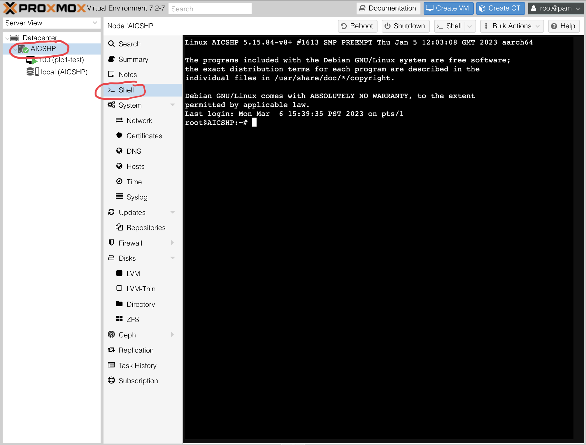

8. Allow Proxmox to utilize more RAM:
    - `$ vim /etc/dphys-swapfile` <-- "console-based" editor will work (vim, nano, etc.)
    - change the value of CONF_SWAPSIZE  **(line 16)** from 100 to either 1024 or 2048 depending on which model pi you're using

9. Download the Ubuntu 22.04.2 server for arm64 iso in Proxmox:
    - 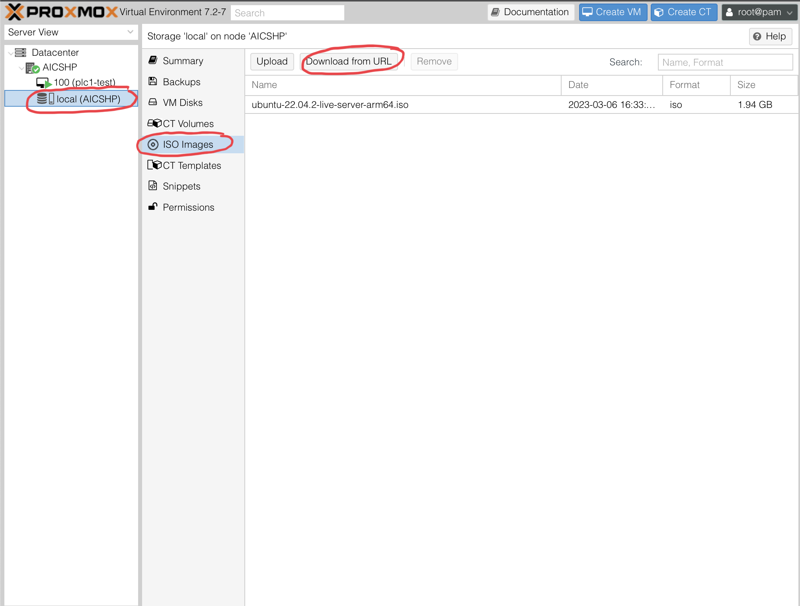
    - [Ubuntu Server for Arm64](https://cdimage.ubuntu.com/releases/22.04/release/ubuntu-22.04.2-live-server-arm64.iso)

10. Create the VM:
    - 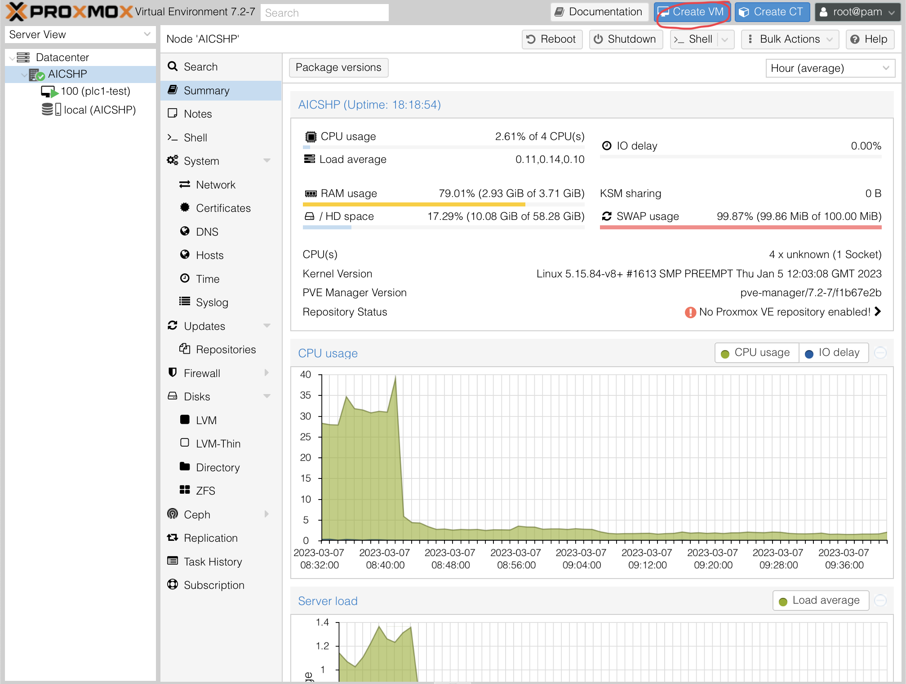
    - Name the VM
    - 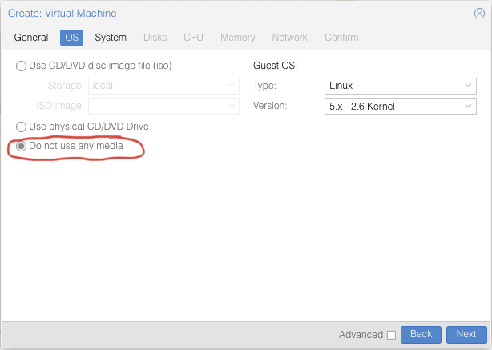 
    - 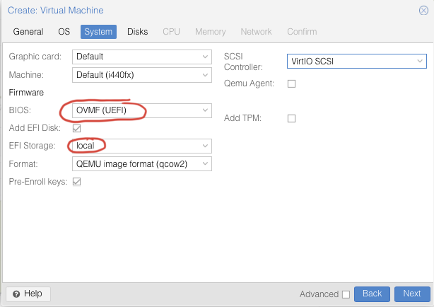 
    - 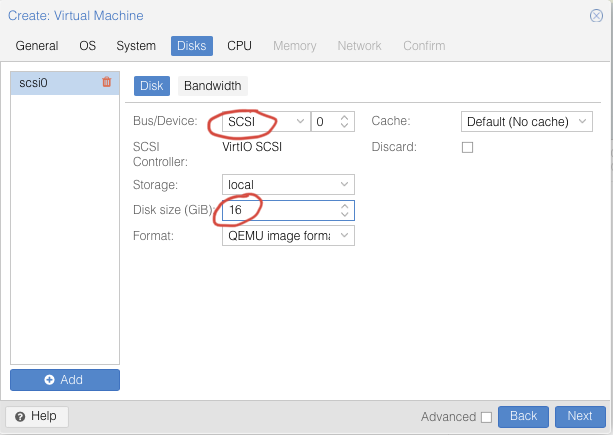 
    - 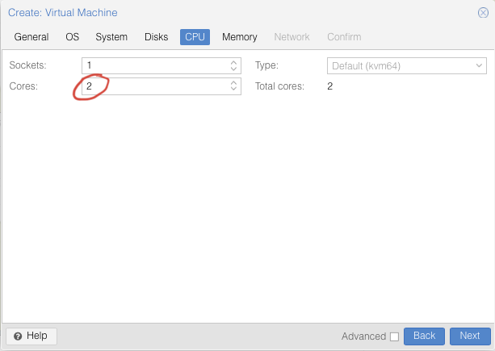 
    - Give the VM 2 Gb of RAM
    - Leave the network settings exactly how they are by default
    - Confirm your choices
    - 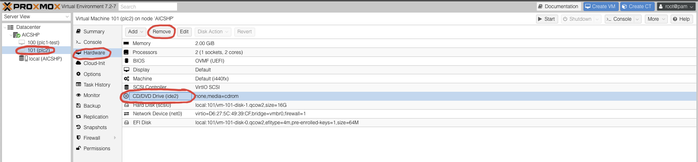
    - 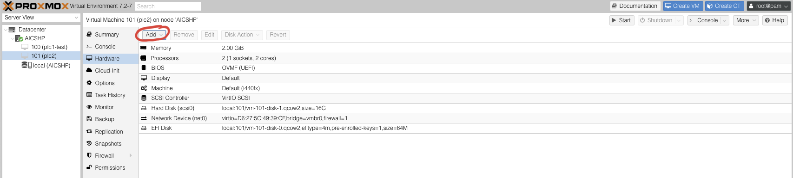  
    - 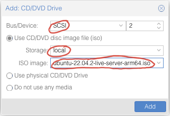
    - 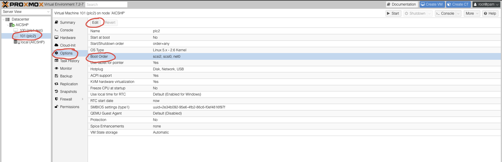
    - 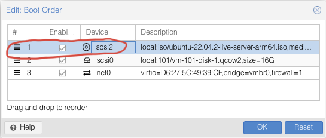
    - 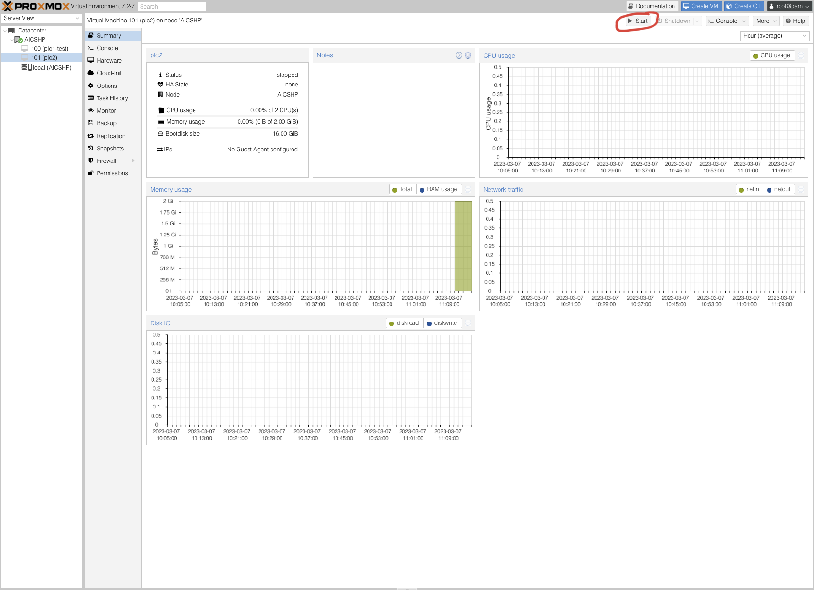

11. Ubuntu Server Installation Options:
    - 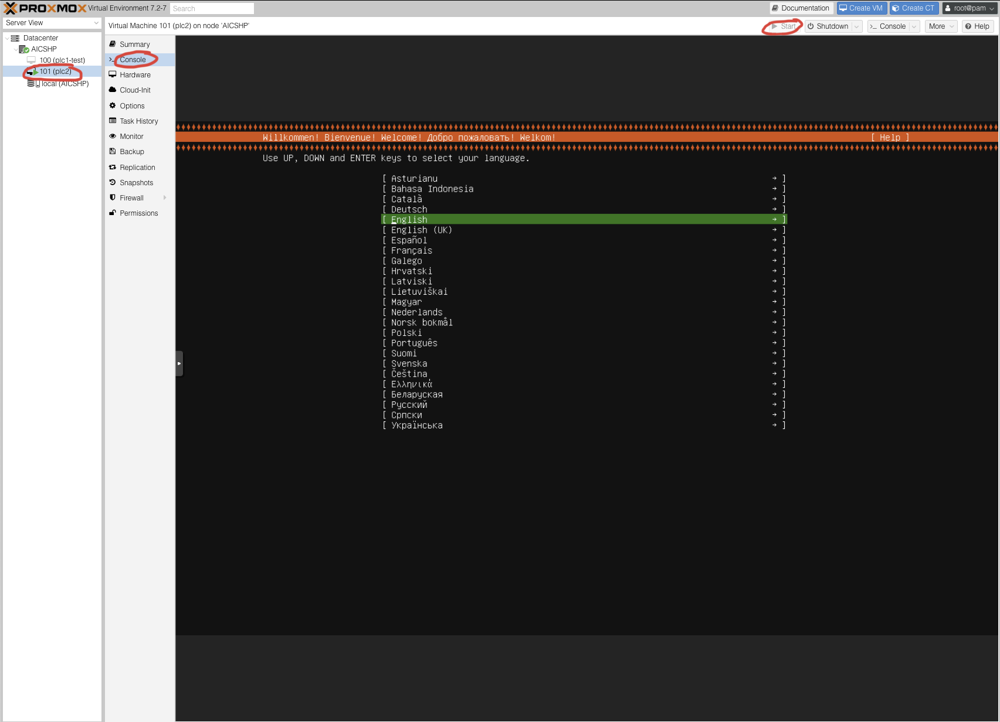
    - **DO NOT INSTALL OPENSSH-SERVER THROUGH THE INSTALL PROMPT**
        - This breaks the VM for some reason
    - Language
    - Keyboard Layout
    - *Ubuntu Server*
    - Auto Configured Network Connection
    - No Proxy
    - Default Storage Configuration Options
    - Name
    - Server Name
    - Username & Password <-- *make sure the username is **aicshp** or things will break later*
    - Skip pro
    - *Install openssh server*
    - No server snaps

12. Once the installation completes, *stop* the VM and change the boot order 
    - 

---

## Installing OpenPLC and Other Requirements

---

### Arm64 Installation Script

1. Download the installation script from github
    - `$ curl https://raw.githubusercontent.com/VigilantBag/AICSHP/openplc/arm_based_installation/scripts/openplc_arm_install.sh > openplc_arm_install.sh` <-- download the custom installation

2. Change the permissions on openplc_arm_install.sh
    - `$ sudo chmod 755 openplc_arm_install.sh`

3. Run the installation script
    - `$ bash /home/aicshp/openplc_arm_install.sh`
    - Enter your username and password when prompted

### iNotify Script

1. Run the inotify script
    - `$ sudo bash /home/aicshp/inotifyfilechange_arm.sh` <-- Run the inotify script before opening an FTP connection from another computer with your custom st_files

2. On another computer open an ftp connection with the PLC you wish to add your custom st_file to
    - on windows ftp connections must be allowed
    - on macOS homebrew can be used to install an ftp client

3. Transfer the st_file to the plc, the plc should then reboot with the new program installed and running

### Sanity Checks

1. Download the sanity check files from Github
    - `$ wget https://raw.githubusercontent.com/VigilantBag/AICSHP/openplc/arm_based_installation/sanity_check/read_plc1.py` <-- download both the files required to read the coils of the plcs
    - `$ wget https://raw.githubusercontent.com/VigilantBag/AICSHP/openplc/arm_based_installation/sanity_check/read_plc2.py`

2. Change the IP addresses within each read_plc*.py file
    - The ip address for the plc you're checking must be inserted in place of the stars in the image below
    - 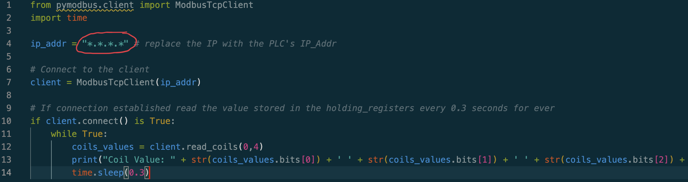 

3. Run the read_plc*.py program with the plcs running

### ScadaBR Setup

1. On a separate x86 computer, install [VirtualBox](https://www.virtualbox.org/wiki/Downloads)
2. With virtual box installed, download the [ScadaBR Image](https://drive.google.com/file/d/1gEOZmN9_Nt5shXy4iYS1z_EMxB4r0Kzh/view)
3. Import the ScadaBR image in VirtualBox:
    - click File < Import Appliance < (Choose the ScadaBR image you downloaded)
    - open the settings of the virtual machine
    - make sure the adapter is set to bridged in the network tab
4. Open the website on the login screen *http://virtual-machine-ip:8080/ScadaBR*
    - default username: admin
    - default password: admin
5. Connecting the plcs:
    - In the *Data Sources* tab add a *BACnet I/P* data source
    - Name the source
    - Set the *transport type* to *TCP with keep-alive*
    - Add the IP address of the master-plc to the *Host* tab
    - Set the *port* to 502
    - In the points tab click *Add Point*
        - *Name* the point
        - Choose *Coil Status*
        - Make sure the *Slave id* is set to 1
    - Repeat the same process for the slave plc, instead using its ip address, name, *port* 502, and the same information in the points tab
