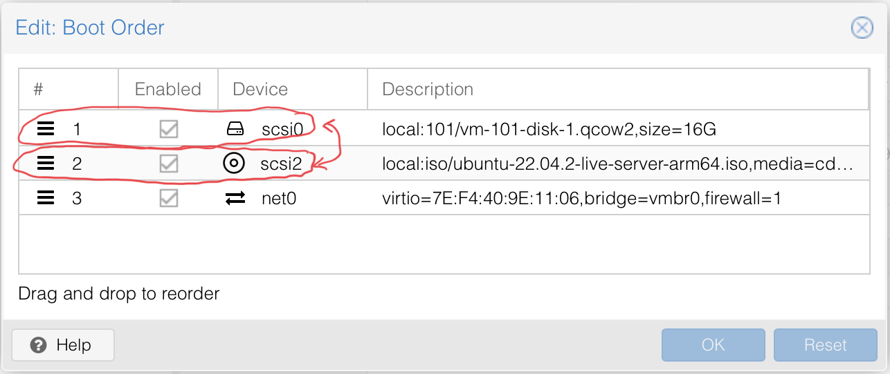

# Arm64 (rpi) Pimox and OpenPlc Installation instructions

**Important Notes**

- [Pimox Github](https://github.com/pimox/pimox7)
- This works as of March 7, 2023.
- You must use a pi with 4GB or more of RAM, 8 GB is reccomended. 

---

## Setting Up the Physical Pi and Installing Pimox

---

1. Install Pimox using [Raspberry Pi OS Lite (64-bit)](https://downloads.raspberrypi.org/raspios_oldstable_lite_armhf/images/raspios_oldstable_lite_armhf-2023-02-22/2023-02-21-raspios-buster-armhf-lite.img.xz). **This will _ONLY_ work with the 64-bit lite version** 

2. Using the raspberry pi imager software: 
    - enable ssh
    - set the username and password
    - configure LAN (if you're using wifi)
    - set the timezone/keyboard

3. In the raspberry pi lite installation you just created, run:
    - `# sudo su` <-- logins in as root
    - `# apt-get update && apt-get upgrade -y` <-- update the system
    - `# curl https://raw.githubusercontent.com/pimox/pimox7/master/RPiOS64-IA-Install.sh > RPi_Install.sh` <-- downloads the pimox installation script
    - `# chmod +x RPi_Install.sh` <-- make the installation script executable
    - `# ./RPi_Install.sh` <-- run the installation script
    - at this point simply follow the prompts in the script

4. Once the system has been restarted run
    - `# sudo apt upgrade -y` <--upgrades the system one final time finishing the installation

5. Then you should be able to access Pimox at `http://the-ip-you-assigned:8006`

6. The default login is:
    - username: *root*
    - password: *you set this during installation*

7. In the Proxmox web server:
    - 

8. Allow Proxmox to utilize more RAM:
    - `$ vim /etc/dphys-swapfile` <-- "console-based" editor will work (vim, nano, etc.)
    - change the value of CONF_SWAPSIZE  **(line 16)** from 100 to either 1024 or 2048 depending on which model pi you're using

9. Download the Ubuntu 22.04.2 server for arm64 iso in Proxmox:
    - 
    - [Ubuntu Server for Arm64](https://cdimage.ubuntu.com/releases/22.04/release/ubuntu-22.04.2-live-server-arm64.iso)

10. Create the VM:
    - 
    - Name the VM
    -  
    -  
    -  
    -  
    - Give the VM 2 Gb of RAM
    - Leave the network settings exactly how they are by default
    - Confirm your choices
    - 
    -   
    - 
    - 
    - 
    - 

11. Ubuntu Server Installation Options:
    - 
    - **DO NOT INSTALL OPENSSH-SERVER THROUGH THE INSTALL PROMPT**
        - This breaks the VM for some reason
    - Language
    - Keyboard Layout
    - *Ubuntu Server*
    - Auto Configured Network Connection
    - No Proxy
    - Default Storage Configuration Options
    - Name
    - Server Name
    - Username & Password <-- *make sure the username is **AICSHP** or things will break later*
    - Skip pro
    - *Install openssh server*
    - No server snaps

12. Stop the VM and change the 

---

## Installing OpenPLC and Other Requirements

---

### Using the Arm64 Installation Script

1. Download the installation script from github
    - `$ curl https://raw.githubusercontent.com/VigilantBag/AICSHP/openplc/arm_based_installation/scripts/openplc_arm_install.sh > openplc_arm_install.sh` <-- download the custom installation

2. Change the permissions on openplc_arm_install.sh
    - `$ sudo chmod 755 openplc_arm_install.sh`

3. Run the installation script
    - `$ bash /home/your-username/openplc_arm_install.sh`
    - Enter your username and password when prompted